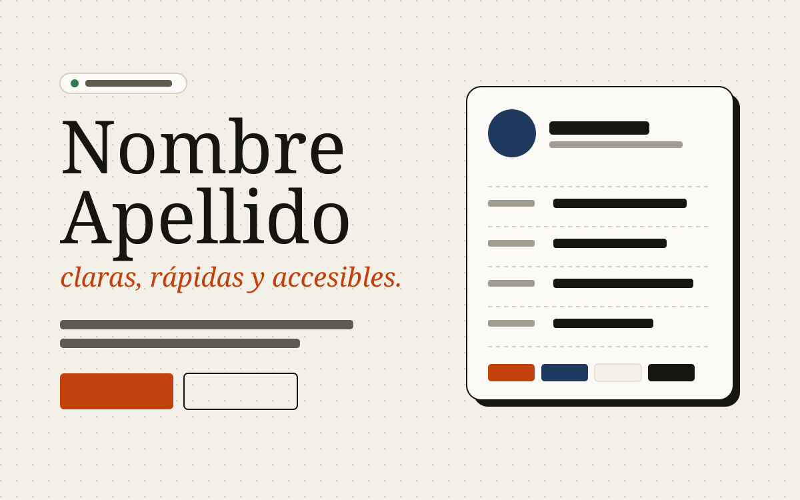

# Portafolio web — Nombre Apellido

Portafolio personal e interactivo hecho con **HTML5 semántico, CSS propio y JavaScript**, sin frameworks ni librerías.
Está pensado para que un reclutador encuentre lo importante en segundos. Arriba hay una **ficha rápida** con el rol que busco, mi stack, formación, ubicación e idiomas, y cada skill enlaza al proyecto que la demuestra.

🔗 **Sitio publicado:** https://tu-usuario.github.io/portafolio/
📁 **Repositorio:** https://github.com/tu-usuario/portafolio



## Secciones

| Sección | Contenido |
| --- | --- |
| Inicio | Presentación, CTA y ficha rápida para reclutadores |
| Sobre mí | Perfil, formación (timeline) e intereses |
| Skills | Skills agrupadas por categoría, cada una con su nivel (1–4) y el proyecto que la respalda |
| Proyectos | 4 cards reutilizables con filtro por tecnología y modal de detalles |
| Design System | Página aparte (`design-system.html`) con colores, tipografía, espaciado, bordes y componentes reales |
| Contacto | Canales directos y formulario validado |

## Tecnologías

- **HTML5**: `header`, `nav`, `main`, `section`, `article`, `aside`, `footer`, `figure`, `figcaption`, `dl`, `dialog`, `template`.
- **CSS3**: Custom Properties (`css/tokens.css`), Flexbox, Grid, `clamp()`, media queries y nomenclatura BEM.
- **JavaScript (ES6+)**: scripts clásicos separados por responsabilidad, sin dependencias.
- **Git + GitHub Pages** para el control de versiones y la publicación.

## Funcionalidades JavaScript

1. **Tema claro/oscuro** que se guarda en `localStorage`. Si nunca eliges uno, sigue al del sistema.
2. **Menú responsive** con `aria-expanded`. Se cierra con Esc, al hacer clic fuera o al elegir un enlace.
3. **Navegación dinámica (scrollspy)**: marca en el menú la sección que se está viendo.
4. **Filtro de proyectos** por tecnología, con un contador accesible (`aria-live`).
5. **Modal de proyecto** con `<dialog>` nativo: problema, solución, rol, aprendizajes y enlaces.
6. **Validación del formulario** con mensajes propios por campo y contador de caracteres. El envío abre el cliente de correo con el mensaje listo (`mailto:`).
7. **Paleta de comandos** (`Ctrl + K`) para saltar a secciones y ejecutar acciones con el teclado.
8. **Copiar correo** con notificación (toast), **botón para volver arriba**, **animaciones de aparición** que respetan `prefers-reduced-motion` y **reloj con la hora local**.

## Estructura

```
├── index.html              # Página principal
├── design-system.html      # Documentación del sistema visual
├── css/
│   ├── tokens.css          # Variables: colores, tipografía, espaciado, radios, sombras
│   ├── base.css            # Reset y estilos de elementos
│   ├── layout.css          # Header, secciones, grids y breakpoints
│   ├── components.css      # Botones, cards, badges, inputs, modal…
│   └── design-system.css   # Estilos solo de la página de documentación
├── js/
│   ├── theme-init.js       # Aplica el tema antes de pintar la página
│   ├── theme.js            # Cambio de tema + localStorage
│   ├── navigation.js       # Menú, scrollspy, volver arriba
│   ├── projects.js         # Filtro y modal
│   ├── contact.js          # Validación, mailto, copiar correo, toast
│   ├── command-palette.js  # Paleta Ctrl + K
│   ├── effects.js          # Animaciones, año y reloj
│   └── design-system.js    # Valores de tokens en vivo
└── assets/
    ├── icons/favicon.svg
    └── img/                # Avatar y capturas de proyectos
```

## Cómo verlo en local

Opción 1: abre `index.html` directamente en el navegador. Funciona porque no usa módulos.

Opción 2, con un servidor local:

```bash
# Python
python -m http.server 5500
# o con la extensión "Live Server" de VS Code
```

Luego entra a `http://localhost:5500`.

## Publicación en GitHub Pages

1. Sube el repositorio a GitHub (público).
2. Ve a **Settings → Pages → Build and deployment**.
3. En *Source* elige **Deploy from a branch**, rama `main` y carpeta `/ (root)`.
4. Espera 1–2 minutos y abre `https://tu-usuario.github.io/portafolio/`.

## Accesibilidad

- Enlace "Saltar al contenido", foco visible y navegación completa con teclado.
- Contraste AA en los dos temas.
- `alt` descriptivo en las imágenes, e íconos decorativos con `aria-hidden`.
- Los niveles de las skills también se anuncian como texto para lectores de pantalla.
